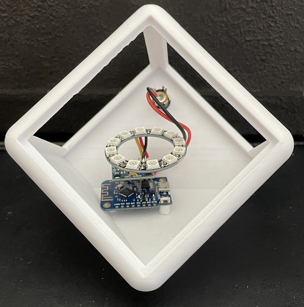
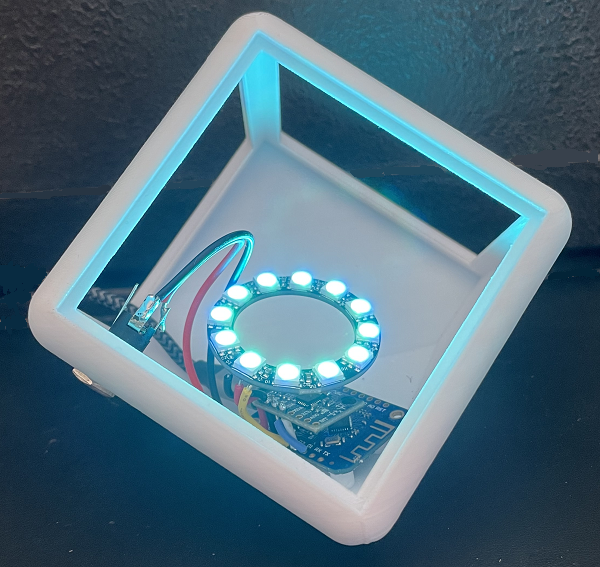
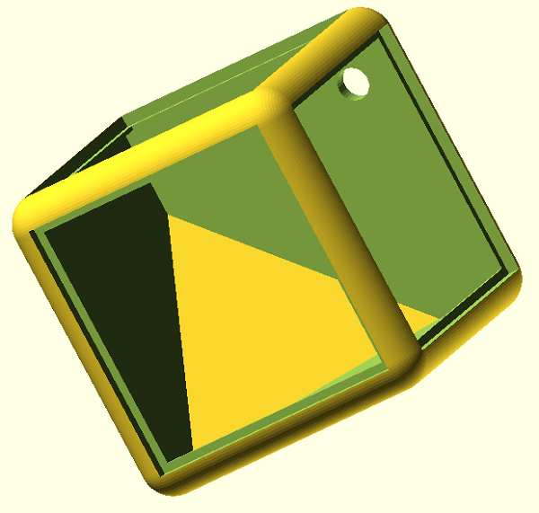
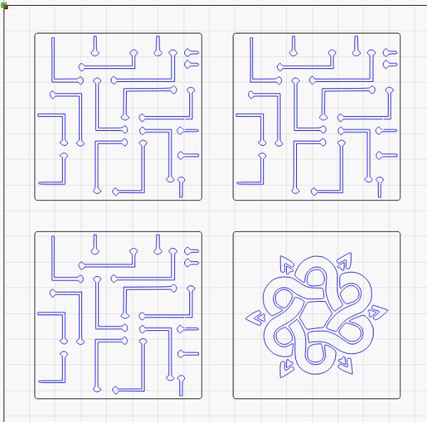
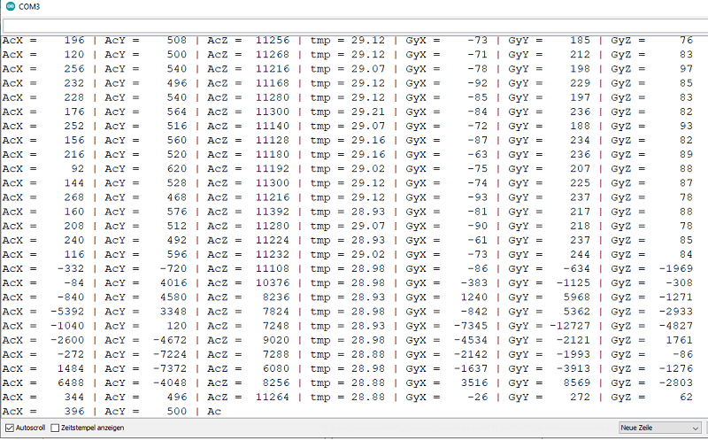
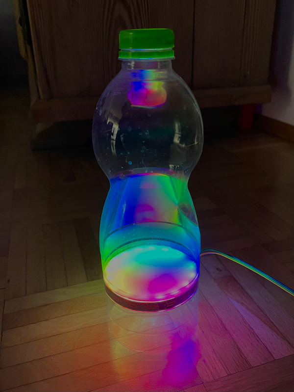

<a name="oben"></a>

# RGB-Cube
RGB-LED Cube mit Farbwechsel, LED Ring WS2812B und GY-521 3-Achsen-Gyroskop

## Story
Dieses Repo beschreibt einen RGB-Cube mit automatischem Farbwechsel bei Bewegung des Würfels. Der RGB-Cube beinhaltet einen WS2812B 50mm LED Ring, ein  3-Achsen-Gyroskop und einen ESP32 D1 Mini (alt. ESP8266).

## RGB-Cube





## 3D-Druck Gehäuse


## Gehäuse Folie



## Hardware

| Anzahl | Bezeichnung | 
| -------- | -------- | 
|  1 |  ESP32 D1 Mini  |
|  1 |  alt. ESP8266 |
| 1  | WS2812B 50mm LED Ring   |
|  1 |  GY-521 3-Achsen-Gyroskop  |
|  1 | LM2596S Netzteil   |
|  1 | 9V Batterieclip   |
|  1 | 9V Batterie (alt. 5V Netzteil) |
|  1 |   Gehäuse |
|  1 |   Polystyrol-Folie weiß DIN A4 |
|   |   Kabel |
| ---  | ---   |


## Verdrahtung

| ESP8266 | GY-521 | WS2812B | 
| -------- | -------- | -------- |
|  D1 |  SCL   | --- |
|  D2 |  SDA | --- |  
| D3  | ---  | IN |
|  +5V  |  +5V  | +5V |
|  GND | GND   | GND  |
|  --- | ---  | --- |


## Serieller Monitor




## Gyro-Sensor Test

```C++
#include "Wire.h"

#define MPU6050_ADDR 0x68 // Alternatively set AD0 to HIGH  --> Address = 0x69

int16_t accX, accY, accZ, gyroX, gyroY, gyroZ, tRaw; // Raw register values (accelaration, gyroscope, temperature)
char result[7]; // temporary variable used in convert function

void setup() {
  Serial.begin(9600);
  Wire.begin();
  Wire.beginTransmission(MPU6050_ADDR);
  Wire.write(0x6B); // PWR_MGMT_1 register
  Wire.write(0); // wake up!
  Wire.endTransmission(true);
}
void loop() {
  Wire.beginTransmission(MPU6050_ADDR);
  Wire.write(0x3B); // starting with register 0x3B (ACCEL_XOUT_H)
  Wire.endTransmission(false); // the parameter indicates that the Arduino will send a restart.
  // As a result, the connection is kept active.
  Wire.requestFrom(MPU6050_ADDR, 14, true); // request a total of 7*2=14 registers

  // "Wire.read()<<8 | Wire.read();" means two registers are read and stored in the same int16_t variable
  accX = Wire.read() << 8 | Wire.read(); // reading registers: 0x3B (ACCEL_XOUT_H) and 0x3C (ACCEL_XOUT_L)
  accY = Wire.read() << 8 | Wire.read(); // reading registers: 0x3D (ACCEL_YOUT_H) and 0x3E (ACCEL_YOUT_L)
  accZ = Wire.read() << 8 | Wire.read(); // reading registers: 0x3F (ACCEL_ZOUT_H) and 0x40 (ACCEL_ZOUT_L)
  tRaw = Wire.read() << 8 | Wire.read(); // reading registers: 0x41 (TEMP_OUT_H) and 0x42 (TEMP_OUT_L)
  gyroX = Wire.read() << 8 | Wire.read(); // reading registers: 0x43 (GYRO_XOUT_H) and 0x44 (GYRO_XOUT_L)
  gyroY = Wire.read() << 8 | Wire.read(); // reading registers: 0x45 (GYRO_YOUT_H) and 0x46 (GYRO_YOUT_L)
  gyroZ = Wire.read() << 8 | Wire.read(); // reading registers: 0x47 (GYRO_ZOUT_H) and 0x48 (GYRO_ZOUT_L)

  Serial.print("AcX = "); Serial.print(toStr(accX));
  Serial.print(" | AcY = "); Serial.print(toStr(accY));
  Serial.print(" | AcZ = "); Serial.print(toStr(accZ));
  // from data sheet:
  Serial.print(" | tmp = "); Serial.print((tRaw + 12412.0) / 340.0);
  Serial.print(" | GyX = "); Serial.print(toStr(gyroX));
  Serial.print(" | GyY = "); Serial.print(toStr(gyroY));
  Serial.print(" | GyZ = "); Serial.print(toStr(gyroZ));
  Serial.println();

  delay(1000);
}

char* toStr(int16_t character) { // converts int16 to string and formatting
  sprintf(result, "%6d", character);
  return result;
}
```
## Rainbow-Lampe mit einem NANO



---

<div style="position:absolute; left:2cm; ">   
<ol class="breadcrumb" style="border-top: 2px solid black;border-bottom:2px solid black; height: 45px; width: 900px;"> <p align="center"><a href="#oben">nach oben</a></p></ol>
</div>  

---

