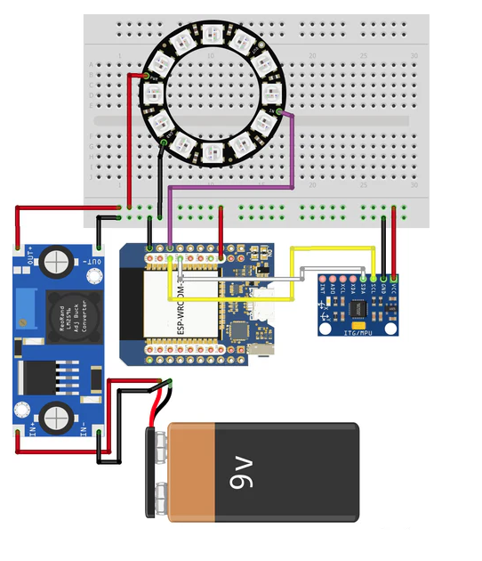

# RGB-Cube
RGB-LED Cube mit Farbwechsel, LED Ring WS2812B und GY-521 3-Achsen-Gyroskop

## Story
Dieses Repo beinhaltet einen RGB-Cube mit automatischem Farbwechsel bei Bewegung des Würfels. Der RGB-Cube beinhaltet einen WS2812B 50mm LED Ring, ein  3-Achsen-Gyroskop und einen ESP32 D1 Mini.

## Hardware

| Anzahl | Bezeichnung | 
| -------- | -------- | 
|  1 |  ESP32 D1 Mini  |
| 1  | WS2812B 50mm LED Ring   |
|  1 |  GY-521 3-Achsen-Gyroskop  |
|  1 | LM2596S Netzteil   |
|  1 | 9V Batterieclip   |
|  1 | 9V Batterie  |
|   |   Kabel |
| ---  | ---   |

## Verdrahtung

---

   
<ol class="breadcrumb" style="border-top: 2px solid black;border-bottom:2px solid black; height: 45px; width: 900px;"> 
<a href="#oben">nach oben</a>
</ol>

  

---

